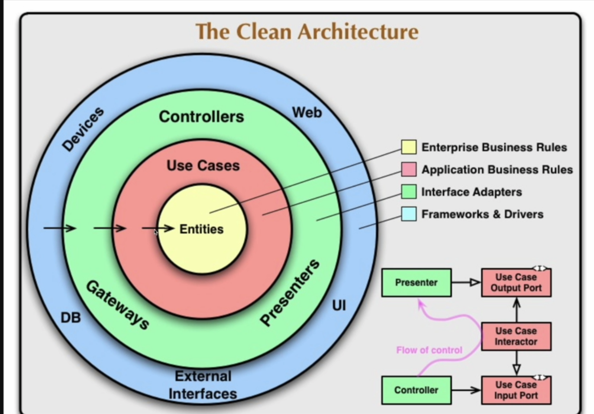

# GolangでTaskアプリを作る
設計は、Clean Architectureでおこないます。



main.goを作成したら、`go mod init`を実行して、モジュールを作成します。
```bash
go mod init 2
```

Echoをインストールします。
```bash
go get -u github.com/labstack/echo/v4
```

go mod tidyを実行して依存関係を解決します。
```bash
go mod tidy
```

## Echoを使うサンプル

```go
package main

import (
	"fmt"
	"github.com/labstack/echo/v4"
	"github.com/labstack/echo/v4/middleware"
)

func main() {
	e := echo.New()

	e.Use(middleware.Logger())// Loggerはリクエストとレスポンスの情報を出力する
	e.Use(middleware.Recover())// パニックが発生した場合に500エラーを返す

	e.GET("/tasks", func(c echo.Context) error {
		fmt.Println("get all tasks")
		return c.String(200, "get all tasks")
	})
	e.POST("/tasks", func(c echo.Context) error {
		fmt.Println("create a task")
		return c.String(200, "create a task")
	})

	// サーバーを起動する
	e.Start(":8080")
}
```